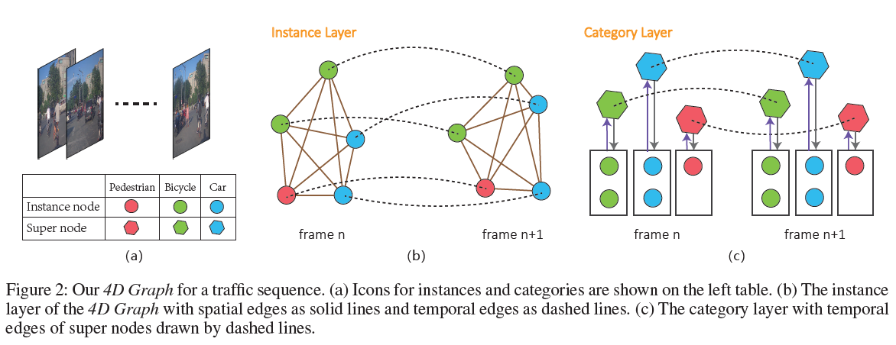

## 論文連結
[TrafficPredict: Trajectory Prediction for Heterogeneous Traffic-Agents](https://arxiv.org/pdf/1811.02146.pdf) 
（在讀這篇之前最好先讀[Social Attention: Modeling Attention in Human Crowd](https://arxiv.org/pdf/1710.04689.pdf)，TrafficPredict裡面有很大一部分是從Social Attention來的。）

## Introduction
這篇聚焦在在Heterogeneous（包含不同的agents, including vehicles, pedestrians, bikes ...）上。 
Main Results：
1. a novel LSTM-based algorithm (new approach for trajectory prediction in heteogeneous traffic) -> **4D GRAPH**
2. collect a  new dataset
3. smaller prediction error

## System Overview

